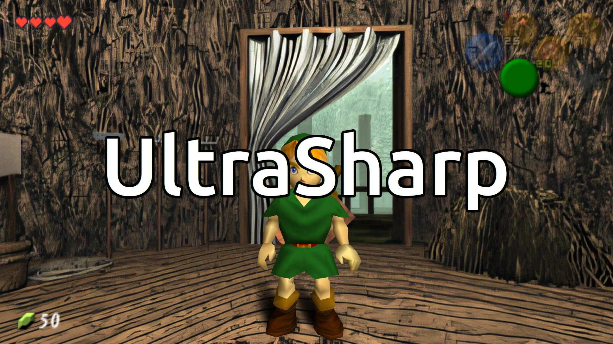

# OoT
Scripts for modding OoT on SoH


## UltraScale
This script attempts to seamlessly rescale the static backgrounds in Ocarina of Time (OoT) when runnin Ship of Harkinian (SoH). Images aren't simply rescaled as they are, they are first stripped of their padding and formed into a panoramic montage before being scaled by the 'ultrasharp' AI model. The panorama is then sliced up into constituent parts and padding reapplied. Scaling this way gives the model more context and avoids visible seams in game.




What do you need?

- Real-ESRGAN - https://github.com/xinntao/Real-ESRGAN-ncnn-vulkan

- The ultrasharp model - https://github.com/upscayl/upscayl/tree/main/resources/models

- Retro - https://github.com/GhostlyDark/retro

- __Your own copy of the original game assets.__ I'd suggest starting with Retro to extract textures in the required directory structure & using a decomp do replace any corrupt PNGs (may be fixed in future).


Once you have everything, you will need to copy the pre-rendered images and make sure that they follow the directory structure shown in the __renders_tree.txt__ in this repo. To run the ultrascale script, just pass it the parent directory and it will process the files recursively. Note that they will be overwritten, so work on a copy. ;)

Usage example:
```
bash ultrascale.sh oot/
```

When done, use retro to build an otr file for SoH. Directions can be found here: https://github.com/GhostlyDark/OoT-Reloaded-SoH


## UnderScale
In contrast to the UltraScale, the aim of this script is to scale the Reloaded texture pack proportionally to the original textures. This results in much of it being downscaled, which is a good thing. While high quality, many of the texture replacements are just too big and cause stutter. A 4x scale over the originals is sufficient at 1080p and 8x looks great at 1440p. Using 4x allows me to run SoH on an old micro office pc and the visuals remain a huge increase over standard.

The script takes the source dir as the first argument and the Reloaded dir the second. Each texture found in the source dir is compared against its counterpart and scaled accordingly. Nothing is overwritten, the created images are saved in a new directory.

Get the Reloaded texture pack here: https://github.com/GhostlyDark/OoT-Reloaded-SoH

You can use Retro to extract original textures from your SoH oot to use as the source reference in this instance. Dispite some missing color channels, the sizes will be correct and that's all that we need them for here.

Usage example:
```
bash underscale.sh oot/ texture\ packs/OoT-Reloaded/
```

When done, use retro to build an otr file for SoH, as above.

